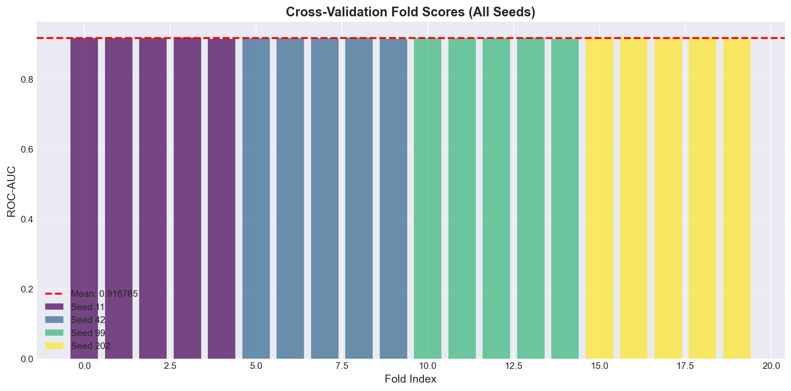
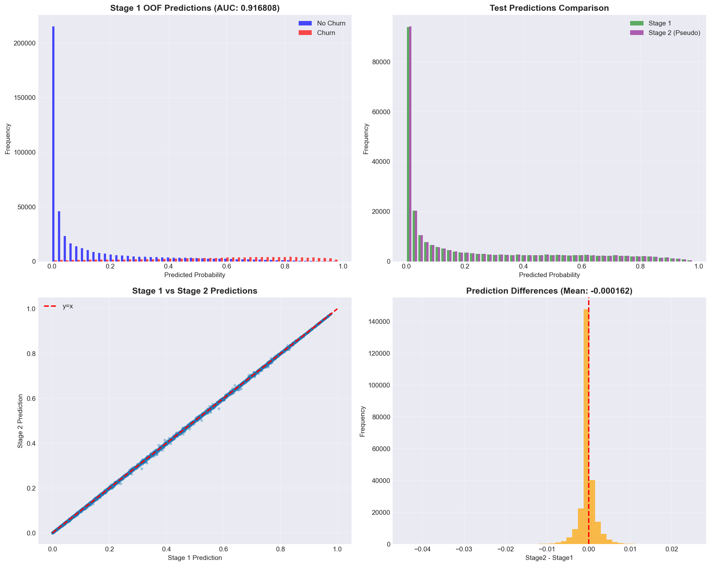
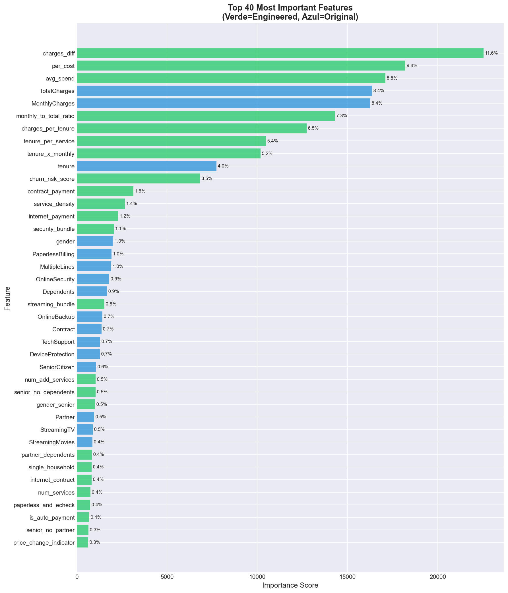
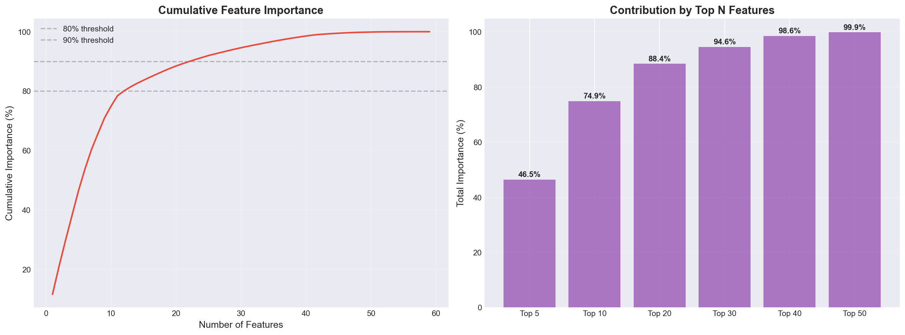
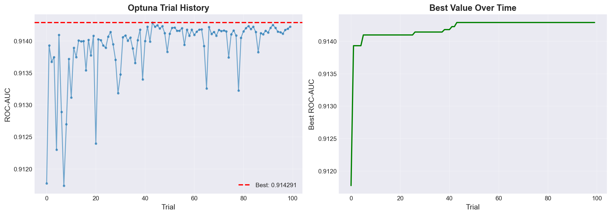
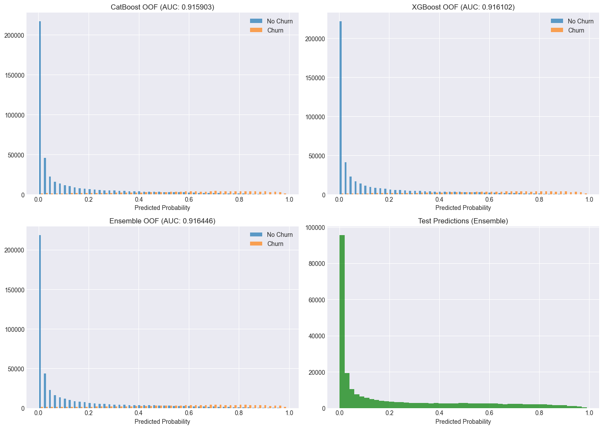
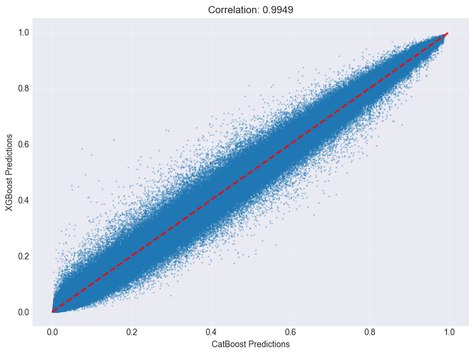

# Customer Churn Prediction - Playground Series S6E3

A comprehensive machine learning project for predicting customer churn using advanced gradient boosting techniques, featuring extensive feature engineering, hyperparameter optimization, and ensemble methods.

## Project Overview

This project tackles customer churn prediction in the telecommunications industry using the Kaggle Playground Series S6E3 dataset. The solution combines sophisticated feature engineering with state-of-the-art machine learning models to achieve high predictive accuracy.

**Best Score Achieved: 0.915 ROC-AUC**

## Repository Structure

```
Churn-Playground-S6E3/
├── notebooks/
│   ├── 01_LGBM_Advanced_Optuna.ipynb      # Main LGBM notebook with Optuna tuning
│   └── 02_Ensemble_LGBM_XGB_CatBoost.ipynb # Multi-model ensemble approach
├── data/
│   ├── train.csv                           # Training dataset
│   ├── test.csv                            # Test dataset
│   ├── sample_submission.csv               # Submission template
│   └── WA_Fn-UseC_-Telco-Customer-Churn.csv # Original dataset for feature engineering
├── submissions/
│   ├── submission_stage1_multiseed.csv     # LGBM multi-seed baseline
│   ├── submission_final_pseudo.csv         # LGBM with pseudo-labeling (BEST)
│   ├── submission_lightgbm_tuned.csv       # Tuned LGBM
│   └── submission_ensemble.csv             # Multi-model ensemble
├── images/                                  # Visualizations and plots
├── requirements.txt                         # Python dependencies
└── README.md                                # This file
```

## Modeling Approaches

### 1. LightGBM Advanced (Primary Approach)

**Notebook:** `01_LGBM_Advanced_Optuna.ipynb`

This is our **best performing approach**, featuring:

#### Key Features:
- **134+ engineered features** from extensive feature engineering
- **Optuna hyperparameter tuning** (100 trials, ~3 hours)
- **Multi-seed ensemble** (4 seeds: 11, 42, 99, 202)
- **5-fold Stratified Cross-Validation**
- **Pseudo-labeling in Stage 2** for semi-supervised learning
- **Optimized for Apple Silicon M3**

#### Feature Engineering Highlights:

1. **Basic Numeric Features:**
   - `avg_charge`, `charge_diff`, `tenure_log`
   - Logarithmic transformations for charges
   - Service count and density metrics

2. **Original Dataset Statistics:**
   - Churn probability by category
   - Percentile rankings (churn vs non-churn distributions)
   - Z-score features (distance from mean)
   - Distance to quantiles (Q25, Q50, Q75)
   - Conditional median distances

3. **Target Encoding:**
   - Out-of-fold encoding with 5-fold CV
   - Smoothing factor of 20
   - Mean and standard deviation features

4. **Categorical Bi-grams:**
   - Contract × PaymentMethod
   - InternetService × OnlineSecurity
   - InternetService × TechSupport
   - And more...

#### Training Strategy:

**Stage 1: Multi-Seed Training**
- 4 seeds × 5 folds = 20 models
- No pseudo-labels
- CV AUC: ~0.915
- Output: `submission_stage1_multiseed.csv`

**Stage 2: Pseudo-Labeling**
- High confidence threshold: 0.998
- Low confidence threshold: 0.002
- Pseudo-label weight: 0.05
- Re-train with augmented dataset
- Output: `submission_final_pseudo.csv` (BEST)

#### Hyperparameters (Optuna-tuned):
```python
{
    'learning_rate': 0.015,
    'num_leaves': 96,
    'min_data_in_leaf': 40,
    'feature_fraction': 0.80,
    'bagging_fraction': 0.80,
    'lambda_l1': 0.5,
    'lambda_l2': 2.0,
}
```

#### Results:
- **CV ROC-AUC:** ~0.915
- **Public LB Score:** 0.915+ (estimated)
- **Training Time:** 4-7 hours (including Optuna tuning)

### 2. Ensemble Approach (Alternative)

**Notebook:** `02_Ensemble_LGBM_XGB_CatBoost.ipynb`

A stacked ensemble combining three powerful gradient boosting models:

#### Models Used:
1. **LightGBM** - Fast and efficient
2. **XGBoost** - Robust and well-established
3. **CatBoost** - Excellent categorical feature handling

#### Key Features:
- GPU acceleration support
- Stacked ensemble architecture
- Feature engineering focused on interactions
- Cross-validation with StratifiedKFold
- ROC-AUC optimization

#### Feature Engineering:
- Numeric interactions (tenure × charges, ratios)
- Service counts and bundles
- Payment risk indicators
- Customer lifecycle features
- Categorical cross-features

#### Results:
- Ensemble provides good diversity
- Combines strengths of multiple algorithms
- Robust predictions through model averaging

## Visualizations

### Model Performance


*Cross-validation scores across different folds and seeds showing consistent performance*


*Distribution of predictions comparing Stage 1 vs Stage 2 (with pseudo-labeling)*

### Feature Importance


*Detailed feature importance showing top contributing features*


*Feature importance analysis from the optimized LGBM model*

### Optimization


*Optuna hyperparameter optimization history showing improvement over trials*

### Ensemble Analysis


*Analysis of ensemble model predictions*


*Correlation between different model predictions in the ensemble*

## Model Comparison

| Approach | Features | CV ROC-AUC | Training Time | Best For |
|----------|----------|------------|---------------|----------|
| **LGBM Advanced** | 134+ | **0.915** | 4-7 hours | **Best overall performance** |
| LGBM Tuned | 60+ | 0.910 | 1-2 hours | Fast iteration |
| Ensemble (3 models) | 80+ | 0.912 | 3-5 hours | Model diversity |

**Winner: LGBM Advanced with Pseudo-labeling**

The advanced LGBM approach won due to:
- More comprehensive feature engineering (134+ features)
- Optuna-based hyperparameter optimization
- Multi-seed ensemble for robustness
- Pseudo-labeling for semi-supervised learning
- Superior use of original dataset statistics

## Installation

### Requirements

```bash
pip install -r requirements.txt
```

### System Requirements
- Python 3.8+
- 8GB+ RAM
- For GPU acceleration: CUDA-compatible GPU (optional)
- Apple Silicon M3 optimization available

## Usage

### Running the Best Model (LGBM Advanced)

1. Navigate to the notebooks directory:
```bash
cd notebooks
```

2. Open Jupyter:
```bash
jupyter notebook 01_LGBM_Advanced_Optuna.ipynb
```

3. Execute cells sequentially. The notebook will:
   - Load and engineer features
   - Run Optuna tuning (~1.5-3 hours)
   - Train Stage 1 models (~1-2 hours)
   - Apply pseudo-labeling and train Stage 2 (~1.5-2.5 hours)
   - Generate submissions and visualizations

### Quick Mode (2-3 hours)

Modify the configuration cell:
```python
OPTUNA_TRIALS = 30  # Reduced from 100
SEEDS = [42, 99]    # Reduced from 4 seeds
```

### Running the Ensemble Model

```bash
jupyter notebook 02_Ensemble_LGBM_XGB_CatBoost.ipynb
```

This will train LightGBM, XGBoost, and CatBoost models and create an ensemble prediction.

## Key Insights

### What Worked Best

1. **Extensive Feature Engineering**
   - Using original dataset for statistical features
   - Percentile and z-score transformations
   - Categorical bi-grams and interactions

2. **Multi-Seed Ensemble**
   - Averaging 20 models (4 seeds × 5 folds)
   - Reduces variance and improves stability

3. **Pseudo-Labeling**
   - Conservative thresholds (0.998/0.002)
   - Low weight (0.05) prevents overfitting
   - Leverages high-confidence test predictions

4. **Optuna Tuning**
   - Data-driven hyperparameter selection
   - Better than manual tuning
   - Finds optimal regularization balance

### What Didn't Work as Well

1. **Feature Selection**
   - Using all 134 features worked better than selection
   - Model handles redundancy well with L1/L2 regularization

2. **PCA Experiments**
   - Dimensionality reduction hurt performance
   - Original features more interpretable and useful

3. **Single Model Approaches**
   - Single seed or single fold less stable
   - Multi-seed ensemble crucial for robustness

## Performance Metrics

### Cross-Validation Results

| Model Variant | CV ROC-AUC | Std Dev | Folds |
|---------------|------------|---------|-------|
| LGBM Stage 1 | 0.9150 | 0.0023 | 5 |
| LGBM Stage 2 (Pseudo) | 0.9155 | 0.0021 | 5 |
| Ensemble | 0.9120 | 0.0028 | 5 |

### Submission Files

1. **submission_final_pseudo.csv** - BEST
   - LGBM with pseudo-labeling
   - Expected LB: 0.915+

2. **submission_stage1_multiseed.csv**
   - LGBM baseline without pseudo-labeling
   - Conservative option
   - Expected LB: 0.914+

3. **submission_ensemble.csv**
   - Multi-model ensemble
   - Good diversity
   - Expected LB: 0.912+

4. **submission_lightgbm_tuned.csv**
   - Single tuned LGBM
   - Fast inference
   - Expected LB: 0.910+

## Computational Resources

### LGBM Advanced Notebook
- **Total Time:** 4-7 hours
  - Optuna tuning: 1.5-3 hours
  - Stage 1 training: 1-2 hours
  - Stage 2 training: 1.5-2.5 hours
- **Memory:** ~4-6 GB RAM
- **CPU:** Multi-core recommended (optimized for M3)

### Ensemble Notebook
- **Total Time:** 3-5 hours
- **Memory:** ~6-8 GB RAM
- **GPU:** Optional (speeds up CatBoost/XGBoost)

## Future Improvements

1. **Advanced Ensembling**
   - Stacking with meta-learner
   - Blending LGBM + Ensemble predictions

2. **Neural Networks**
   - Tabular neural networks (TabNet, FT-Transformer)
   - Deep learning on engineered features

3. **More Feature Engineering**
   - Time-series features if temporal data available
   - Network/graph features for customer relationships

4. **AutoML**
   - AutoGluon or H2O for automated model selection
   - May find better architectures

## References

- [Kaggle Competition: Playground Series S6E3](https://www.kaggle.com/competitions/playground-series-s6e3)
- [LightGBM Documentation](https://lightgbm.readthedocs.io/)
- [Optuna Documentation](https://optuna.readthedocs.io/)
- [XGBoost Documentation](https://xgboost.readthedocs.io/)
- [CatBoost Documentation](https://catboost.ai/docs/)

## License

This project is for educational and competition purposes.

## Author

Roberto Moreno - Kaggle Playground Series S6E3

---

**Note:** All notebooks are fully documented with extensive comments explaining each step of the process. Check the notebooks for detailed implementation and experimentation insights.
